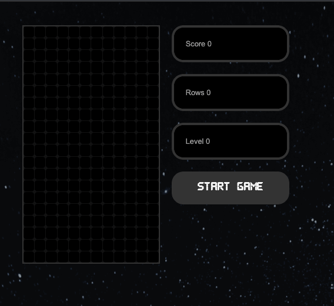

# React Tetris Game build with ReactJS!

This projects was build following the course on **Udemy** **[React Tetris with Hooks API - Intermediate](https://www.udemy.com/course/intermediate-react-tetris/)**.

The course doesn't include Jest testing and other performance improvements.

- [x] Readme
- [x] Jest testing
- [ ] Performance improvements
- [ ] Pause and resume the game
- [ ] Save the scores of different players
